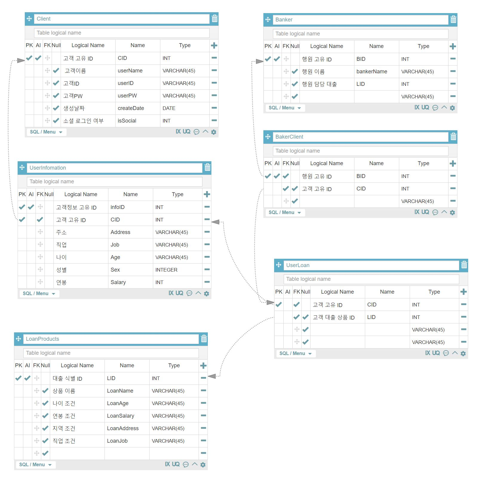

신한은행 대출 서비스 자동 문서 분류 시스템 (프로젝트명 미정)
============= 

스토리
----

### 고객

1. 회원 가입 후 로그인을 한다
2. 현재 내가 대출을 어느 정도 까지 받을 수 있는지 조회한다.
3. 다양한 대출 상품을 볼 수 있다.
4. 대출 서류를 제출하면 어느 부분에 정보가 누락됬는지 보여준다.

### 은행 (주기능)

1. 고객이 스캔한 서류들을 분류한다.
2. 분류된 서류를 DB에서 담당 행원을 검색해, fowarding 해준다.
3. OCR 과 같은 기능을 이용해 고객의 자산정보 등 중요 정보를 간편한 형태로 제공한다.

### 확장기능

1. 미기입된 부분 자동적으로 체크
2. 재판, 부동산 등 다양한 분야로 확장성 고려
3. 제출전 미리 체크 → 어느정도 까지 대출이 나올 수 있을지
4. 솔루션화 해서 만들어 놓는다면 어필이 될 것
5. 공공기관용 대출문서
6. 글을 잘 모르는 분들을 위한 서비스

사용 기술
-------

### frontend : Vue.js

https://kr.vuejs.org/v2/guide/index.html

### backend : fast API

https://fastapi.tiangolo.com/ko/

### deep learning backend : tensorflow

https://www.tensorflow.org/?hl=ko

### deep learning model : VGG16

https://velog.io/@dltjrdud37/CNNVGGNet-Tensorflow%EB%A1%9C-%EC%8B%A4%EC%8A%B5

https://deep-eye.tistory.com/41

https://ichi.pro/ko/chobojaleul-wihan-keras-ui-dangyebyeol-vgg16-guhyeon-184940327513708

### datasets : 신한은행 대출 시 심사 서류기반으로 자동 생성

### database : mySQL (고객계정, 은행직원), MongoDB (고객의 서류 정보)

### 사용 패키지 : fastapi, selenium, tensorflow, keras, pandas, numpy, seaborn, svg

### tool : JIRA, GITLAB, anaconda, jupyter nootbook, colab

해야할 것
------- 
1. DB 스키마 정의

2. 신한은행의 대출 상품 정보 (금리, 한도, 필요 서류, 조건) 조사
3. 적절한 datasets 생성
