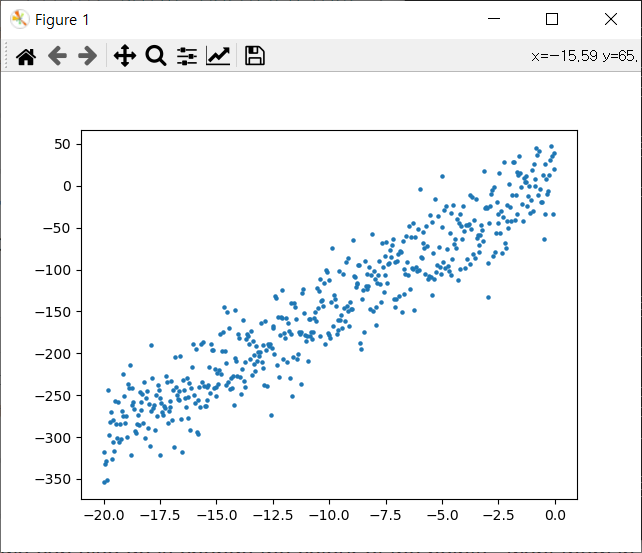
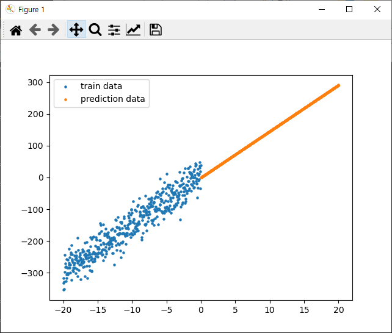
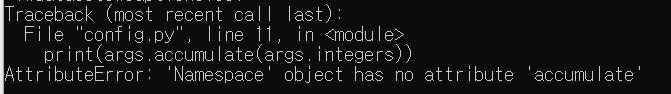

## 인공지능(영상) 프로젝트 결과물

>  인공지능 프로젝트
>
> "이미지 캡셔닝 활용 시스템"
>
> Sub PJT 1 - 인공지능 기초 및 데이터 전처리

#### 학습 내용

1. linear_regression.py

   - 데이터 확인

   

   - 결과물

   

2. config.py

   - 실행에러

     > "accumulate" error

   

